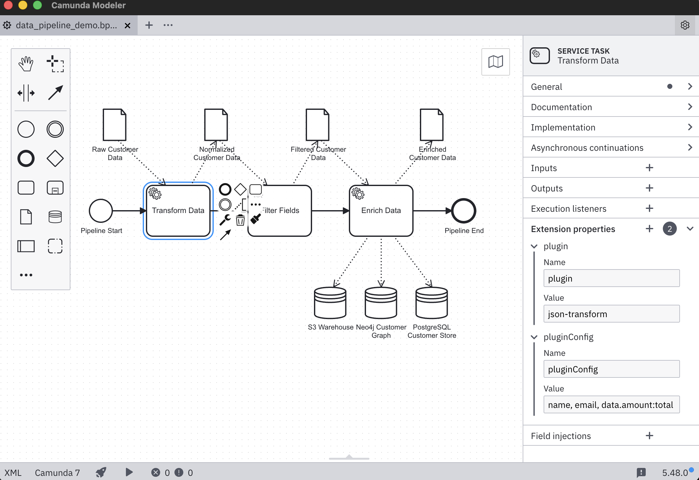
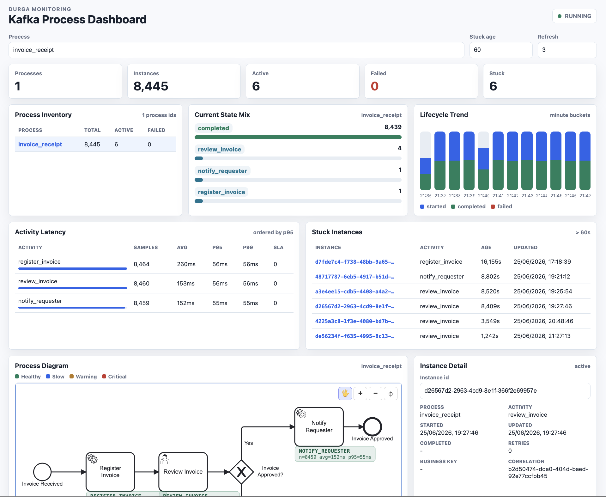

# Durga

[](https://github.com/FrodeRanders/durga/actions/workflows/ci.yml)
[](https://github.com/FrodeRanders/durga/actions/workflows/build.yml)
[](LICENSE)
[](https://adoptium.net/)
[](pom.xml)

BPMN → Kafka code generation and process monitoring. Two tools:

- **Scaffolder** — reads a BPMN model and generates Kafka-oriented worker, gateway, orchestration, and topic setup skeletons.
- **Monitoring app** — a Quarkus SPA that tracks all running Durga processes via Kafka Streams, showing state, latency, stuck instances, and BPMN diagrams with live overlays.

[System manual](doc/system/sysdoc.pdf) | [BPMN coverage matrix](doc/bpmn-kafka-coverage.md) | [Beta support boundary](doc/beta-support-boundary.md) | [Maturity plan](doc/maturity-plan.md) | [Release checklist](doc/release-checklist.md) | [Operations hardening](doc/operations-hardening.md) | [Deployment guide](doc/deployment.md) | [Plugin architecture](doc/data-pipeline-blueprint.md) | [Testcontainers setup](doc/testcontainers-setup.md)

## Quick start

```bash
mvn -q clean package
java -jar target/durga-0.1.0-beta.1.jar path/to/process.bpmn
```

## Local Kafka setup

```bash
cd setup && docker compose up
```

Kafka UI will log transient connection errors until the broker is ready — this is normal.
The broker listens on `localhost:9094`.

## Running tests

```bash
# Unit tests and generated-project checks (no Docker):
mvn test -Dtest='!*IntegrationTest'

# Monitoring UI tests and build:
cd monitoring-ui && npm ci && npm test && npm run build

# Integration tests (require Docker):
mvn test -Dtest='*IntegrationTest'

# If Docker detection fails, use the Linux container fallback:
./setup/run-integration-tests.sh
```

See [Testcontainers setup](doc/testcontainers-setup.md) for details.

## BPMN scaffolding

Output lands in `generated/` by default:

- Java sources in `generated/src/main/java/org/gautelis/durga/generated/`
- `topics.sh` and `summary.json`
- `task-payloads.json` with sample input payloads
- `pom.xml` and `README.md` for the generated project
- Helper scripts: `demo-scenario.sh`, `send-task-input.sh`, `complete-task.sh`,
  `fail-task.sh`, `escalate-task.sh`, `complete-call-activity.sh`,
  `send-message-event.sh`, `send-signal-event.sh`, `watch-process-events.sh`,
  `watch-task-output.sh`

Flags:

- `--dry-run` — print `summary.json`, `topics.sh`, connect configs, and application YAML without writing files
- `--out <dir>` — custom output directory
- `--event-topic <topic>` — override the canonical lifecycle event topic (default: `process-events-{processId}`). Each pipeline gets an isolated topic by default; use this flag to share a topic across pipelines or use a custom name.
- `--transactions` — generate transactional workers using Kafka producer/consumer APIs

The generator skips existing files in `src/main/java/`, merges new channels into
`application.yml`, and evaluates gateway conditions from BPMN `conditionExpression` at runtime.

## BPMN sample catalog

All sample models live under `src/test/resources/bpmn/`. Run any with:

```bash
mvn -q clean package
java -jar target/durga-0.1.0-beta.1.jar src/test/resources/bpmn/<model>.bpmn
```

| Model | Feature |
|-------|---------|
| `invoice_receipt.bpmn` | Baseline process (start, service, review, approve/reject, notify) |
| `order_fulfillment.bpmn` | Legacy reference model |
| `invoice_receipt_reminder.bpmn` | Intermediate timer catch |
| `invoice_message_exchange.bpmn` | Message throw/catch |
| `invoice_signal_exchange.bpmn` | Signal throw/catch |
| `invoice_review_deadline.bpmn` | Interrupting timer boundary |
| `invoice_review_reminder_non_interrupting.bpmn` | Non-interrupting timer boundary |
| `invoice_processing_error.bpmn` | Interrupting error boundary |
| `invoice_review_escalation.bpmn` | Interrupting escalation boundary |
| `invoice_call_activity.bpmn` | Call activity request/reply |
| `invoice_review_subprocess.bpmn` | Embedded subprocess |
| `invoice_nested_subprocess.bpmn` | Nested subprocesses |
| `invoice_subprocess_deadline.bpmn` | Interrupting timer boundary on subprocess |
| `invoice_subprocess_reminder_non_interrupting.bpmn` | Non-interrupting timer boundary on subprocess |
| `invoice_subprocess_error.bpmn` | Interrupting error boundary on subprocess |
| `invoice_event_subprocess_message.bpmn` | Non-interrupting message-start event subprocess |
| `invoice_event_subprocess_interrupting_message.bpmn` | Interrupting message-start event subprocess |
| `invoice_event_subprocess_timer.bpmn` | Timer-start event subprocess |
| `invoice_event_subprocess_error.bpmn` | Error-start event subprocess |
| `data_pipeline_demo.bpmn` | Plugin-annotated pipeline (json-transform, field-filter, kv-enricher) |
| `order_events_pipeline.bpmn` | 8-plugin order pipeline with XOR gateway; use `--connect` for source/sink |
| `log_processing_pipeline.bpmn` | Regex, template, flatten, validate, mask; use `--connect` |
| `custom_activity_demo.bpmn` | Custom activity with contract interface + delegating worker |

## Monitoring

A Kafka Streams topology consumes per-process lifecycle events and materializes:

- latest state per instance into `process-state`
- counts by state into `process-state-counts`
- active-instance index into `process-active-state`
- activity latency summaries into `process-latency`
- coarse lifecycle trend buckets into `process-trends`
- BPMN model cache into `process-models`

Processes **self-register** by publishing their BPMN 2.0 XML to the
`process-models` Kafka topic on startup. The monitor discovers processes
from this registry — no pre-configured process ID list needed.

### Full-stack dev demo (one command)

```bash
./setup/dev-up.sh
```

Starts **everything** — Kafka in Docker, the monitoring backend, auto-registers
all BPMN models from `src/test/resources/bpmn/`, starts continuous feeds for
`invoice_receipt` and `order_fulfillment`, and serves the Svelte SPA.
Open `http://localhost:8081`. Press Ctrl+C to stop all services.

**Multiple processes:**

```bash
FEED_PIDS="invoice_receipt,order_fulfillment" ./setup/dev-up.sh
```

**Fast restart** (skip builds):

```bash
SKIP_BUILD=true ./setup/dev-up.sh
```

**Configurable environment variables:**

| Variable | Default | Purpose |
|---|---|---|
| `FEED_PIDS` | `invoice_receipt,order_fulfillment` | Comma-separated process IDs to feed |
| `BOOTSTRAP` | `localhost:9094` | Kafka bootstrap servers |
| `PORT` | `8081` | Backend HTTP port (API + SPA) |
| `START_KAFKA` | `true` | Auto-start Kafka via Docker Compose |
| `SKIP_BUILD` | `false` | Skip Maven + npm build |
| `BPMN_DIR` | `src/test/resources/bpmn` | `{pid}.bpmn` directory for diagram fallback |
| `FEED_INTERVAL` | `1000` | Milliseconds between feed lifecycle completions |

### Manual setup

```bash
# Terminal 1 — Kafka
cd setup && docker compose up -d

# Terminal 2 — Build
cd monitoring-ui && npm install && npm run build && cd ..
mvn -q package -DskipTests -Pmonitoring
JAR="$(find target -maxdepth 1 -name 'durga-*-runner.jar' -print -quit)"

# Terminal 3 — Monitoring backend
java -Dquarkus.http.port=8081 -Ddurga.streams.state.dir=/tmp/kafka-streams-state \
  -jar "${JAR}" \
  localhost:9094 durga-monitor

# Terminal 4 — Register BPMN models
for f in src/test/resources/bpmn/*.bpmn; do
  java -cp "${JAR}" \
    org.gautelis.durga.demo.BpmnModelPublisher \
    localhost:9094 "$(basename "$f" .bpmn)" "$f"
done

# Terminal 5 — Feed
java -cp "${JAR}" \
  org.gautelis.durga.demo.ContinuousFeedPublisher \
  localhost:9094 invoice_receipt 1000
```

Open `http://localhost:8081` for the dashboard. The SPA displays an
overview of all registered processes with KPIs. Click any process row to
drill down into latency, stuck instances, trends, instance detail, and
the BPMN diagram.

### HTTP API endpoints

Health is also available at the conventional root path:

- `GET /health` — Kafka Streams state (`RUNNING`, `REBALANCING`, etc.)

The API namespace also exposes:

- `GET /api/health` — Kafka Streams state (`RUNNING`, `REBALANCING`, etc.)
- `GET /api/processes/list` — all known process IDs (from models + counts)
- `GET /api/instances/{processInstanceId}` — latest state view for one instance
- `GET /api/processes/{processId}/counts` — state counts per process
- `GET /api/processes/{processId}/latency` — per-activity latency summaries
- `GET /api/processes/{processId}/trends` — lifecycle trend buckets
- `GET /api/counts` — counts across all monitored processes
- `GET /api/stuck?processId=<id>&olderThanSeconds=60` — stuck-instance detection
- `GET /api/diagram?processId=<id>` — BPMN 2.0 XML from the process-models cache
- `GET /api/metrics` — Micrometer metrics in Prometheus text format

Set `DURGA_MONITORING_API_KEY` or `-Ddurga.monitoring.api.key=<key>` to require
`Authorization: Bearer <key>` on monitoring JSON endpoints. `/api/metrics`
remains unauthenticated for Prometheus-style scrapes.

### CLI client

```bash
JAR="$(find target -maxdepth 1 -name 'durga-*-runner.jar' -print -quit)"

java -cp "${JAR}" \
  org.gautelis.durga.monitoring.ProcessMonitoringClient \
  http://localhost:8081 health

java -cp "${JAR}" \
  org.gautelis.durga.monitoring.ProcessMonitoringClient \
  http://localhost:8081 counts invoice_receipt

java -cp "${JAR}" \
  org.gautelis.durga.monitoring.ProcessMonitoringClient \
  http://localhost:8081 latency invoice_receipt

java -cp "${JAR}" \
  org.gautelis.durga.monitoring.ProcessMonitoringClient \
  http://localhost:8081 stuck invoice_receipt 60

java -cp "${JAR}" \
  org.gautelis.durga.monitoring.ProcessMonitoringClient \
  http://localhost:8081 instance <processInstanceId>
```

For an authenticated monitoring API, set `DURGA_MONITORING_API_KEY` in the
client environment before running the commands.

### Demo scenarios (without a generated process)

```bash
java -cp target/durga-0.1.0-beta.1.jar \
  org.gautelis.durga.demo.ProcessEventScenarioRunner \
  localhost:9094 happy invoice_receipt register_invoice,review_invoice,notify_requester

# Also available: stuck, failed
```

### Docker demo

```bash
docker compose -f setup/docker-compose.demo.yml up --build
```

Starts Kafka, the monitoring backend, and a continuous feed publisher.
Open `http://localhost:8081` for the dashboard (API + SPA),
`http://localhost:8080` for Kafka UI.

```bash
FEED_PROCESS_ID=order_fulfillment FEED_INTERVAL_MS=2000 \
  docker compose -f setup/docker-compose.demo.yml up --build
```

## Generated project probes

Every scaffolded project includes producer and observer helpers:

```bash
./generated/demo-scenario.sh happy
./generated/send-task-input.sh register_invoice
./generated/complete-task.sh approve_invoice <instance-id>
./generated/fail-task.sh register_invoice <instance-id>
./generated/escalate-task.sh review_invoice <instance-id>
./generated/complete-call-activity.sh validate_invoice_process <instance-id>
./generated/send-message-event.sh invoice_review_response_message <instance-id>
./generated/send-signal-event.sh invoice_review_signal_signal <instance-id>
./generated/watch-process-events.sh
./generated/watch-task-output.sh register_invoice
```

Embedded subprocesses generate scope entry/completion services. Event subprocesses with
message or signal starts generate start/completion services driven by external Kafka topics.
Interrupting starts emit cancellation for the enclosing scope; non-interrupting starts
branch alongside the parent flow. Timer, error, and escalation event subprocess starts
are supported within embedded subprocesses.

## User interfaces

Processes (or data pipelines) are managed using any BPMN modeler, such as Camunda Modeler.


The monitoring tool also uses the BPMN model as a backdrop to presenting statistics.

